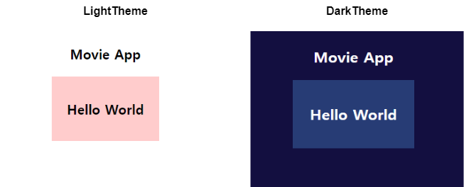

## Toy Project - `Movie App` 작업 정리

- **📆 1일차 / 2024.09.11 수요일**

---

### 초기 프로젝트 세팅

- **Movie App** 개발할 때 사용할 라이브러리들을 설치해줬다.
- 설치한 라이브러리의 목록은 다음과 같다.

``` ts
const Libs = {
    CSS: "styled-components",
    Data_Fetch: "react-query",
    Routing: "react-router-dom"
}
```

- `CSS` 부분은 프로젝트의 규모가 크진 않기 때문에 <br/>
    Component 별로 Style 설정할 수 있는 `styled-components` 채용하였다.
- Open API 통해서 영화 정보를 받아와서 이걸 웹 페이지에 출력할텐데
- Data Fetch 하는 부분은 `react-query`의 숙련도도 높일 겸해서 <br/>
    `react-query` 채용하게 됐다.
- 마지막으로 React 환경에서 Routing 구현하는 방법으로는 <br/>
    `react-router` 쪽이 제일 익숙하기 때문에 자연스럽게 채용하였다.

---

### 테스트 용, 'LightTheme', 'DarkTheme' 구현

- 일단 간단하게 'Light/Dark' 테마를 구현하였다.



- 최상위 Components인 `index.tsx`에 `<ThemeProvider>` import
- 변수 `isDark`의 값이 `true`이면 `DarkTheme`, `false`이면 `LightTheme` theme으로 가진다.

``` tsx
import { ThemeProvider } from 'styled-components';
import { DarkTheme, LightTheme } from './theme';

const root = ReactDOM.createRoot(
  document.getElementById('root') as HTMLElement
);

const queryClient = new QueryClient();

const isDark = false;

root.render(
  <React.StrictMode>
    <ThemeProvider theme={isDark ? DarkTheme : LightTheme}>
        <App />
    </ThemeProvider>
  </React.StrictMode>
);
```
- 테마 전환 기능은 Movie App의 기본적인 부분을 구현한 뒤에
- 진행해도 늦지는 않으니, 지금은 이 정도만 작업하고 마친다.

---

### Open API, 영화 data fetch하기

- 이번 프로젝트에서 사용할 Open API는 일단은 세 종류 정도 된다.
- 사용할 API 목록은 다음과 같다.

```
영화진흥위원회 Open API / Kofic Open API
- 일일 박스오피스 API
- 영화 상세정보 API

한국영화 데이터베이스 Open API / KMDb Open API
- 영화 상세정보 API
```

- 전자의 경우에는 이미 발급해둔 `API Key`가 존재하기 때문에 바로 받아올 수 있었다.
- 다만 후자, `KMDb API Key`는 발급 신청을 따로 했어야 했다.

- 초창기와는 다르게  `react-query`에 대해 알고 있었기 때문에
- `data fetch` 관련 코드를 `MovieFetch.ts` 파일에 전부 모아두고
- `useQuery()` Hook을 통해서 `Movie data`를 받아왔다.

``` ts
//MovieFetch.ts

//Kofic, 일일 박스오피스
export async function MoviesFetch(){
	const Kobis_Data = await fetch("Kofic 일일 박스오피스 API URL");
	const json = await Kobis_Data.json();

	return json;
}

export async function MovieDBFetch(){
	const KMDb_Data = await fetch(KMDb_APIs);
	const json = await KMDb_Data.json();

	return json;
}
```

``` tsx
//App.tsx
import {useQuery} from "react-query";
import { MovieDBFetch, MoviesFetch } from './MovieFetch';

function App(){
	const {isLoading: KoficLoading, data: KoficData} = useQuery({
		queryKey: "Movies",
		queryFn: MoviesFetch
	});
	
	const {isLoading: KMDbLoading, data: KMDb_Data} = useQuery({
		queryKey: "MovieDetail",
		queryFn: MovieDBFetch
	})
	
	return (
		<div>
			/*기존 코드...*/
		</div>
	);
}
```


- `console` 탭에서 위와 같이 영화 `data` 정상적으로 fetch 해온 것을 확인할 수 있다.

